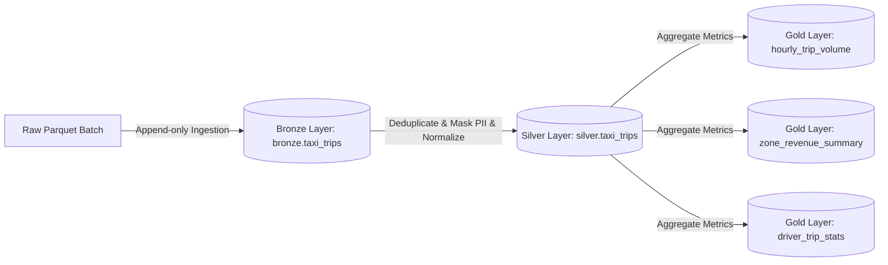

# W2 NYC Taxi Medallion Lakehouse with Apache Iceberg

This repository implements a **Medallion Lakehouse Architecture** (Bronze $\rightarrow$ Silver $\rightarrow$ Gold) for NYC Yellow Taxi trip records, powered by **Apache Iceberg**, **PyIceberg**, and **DuckDB**.

---

## Architecture Overview



- **Bronze Layer (`bronze.taxi_trips`)**: Raw ingested data with audit columns (`ingest_timestamp`, `source_file`).
- **Silver Layer (`silver.taxi_trips`)**: Cleaned and transformed data.
  - **Deduplication**: Drops duplicate records based on a unique trip fingerprint (SHA-256 hash).
  - **PII Masking**: Masks `driver_name` values to initials (e.g., `John Smith` $\rightarrow$ `J.S.`).
  - **Type Normalization**: Standardizes flags (e.g. `store_and_fwd_flag` string converted to boolean).
- **Gold Layer (Aggregated Metrics)**:
  - `gold.hourly_trip_volume`: Number of trips grouped by pickup location and pickup hour.
  - `gold.zone_revenue_summary`: Financial aggregations grouped by pickup and dropoff locations.
  - `gold.driver_trip_stats`: Driver performance metrics (trip counts, revenue, average fare).

---

## Features Showcase

1. **Schema Evolution**: Demonstrates Iceberg's in-place schema updates by adding a derived column `trip_duration_minutes` to the Silver table without rewriting history.
2. **Time Travel**: Queries the Silver table at a specific historical snapshot (before Batch 2 load) using both PyIceberg and DuckDB path-based scanning.
3. **Partition & Query Benchmarking**: Evaluates query latency on `gold.zone_revenue_summary` comparing unpartitioned/unsorted layout against a layout partitioned by `PULocationID` and sorted, proving partition-pruning speedups.
4. **Rich HTML Reporting**: Generates a beautiful, styled glassmorphism dashboard compiling the run metrics, snapshot history, deduplication rate, and benchmark timings at `data/reports/lakehouse_summary.html`.

---

## Local Simulation Mode (Offline Sandbox)

To allow showcasing the entire medallion architecture without requiring Docker, the project supports a standalone python local simulation mode. This initializes an SQL Catalog backed by a local SQLite file (`data/iceberg_catalog.db`) and writes data directly to a local warehouse directory (`data/warehouse/`).

### Requirements
Ensure you have Python 3.10+ (tested on Python 3.13.13) and the required packages installed:
```bash
pip install -r requirements.txt
```

### Triggering the Pipeline
Run the orchestrator script to execute all steps sequentially:
```bash
python run_pipeline_local.py
```

Upon execution, the script will:
1. Generate mock Batch 1 and Batch 2 NYC taxi records with duplicates and PII names.
2. Create `bronze`, `silver`, and `gold` namespaces and tables in the local catalog.
3. Ingest Batch 1 raw records to Bronze, clean and process them to Silver.
4. Evolve the Silver schema by adding the `trip_duration_minutes` column.
5. Ingest Batch 2 raw records and load them to the evolved Silver table.
6. Generate all Gold aggregation tables.
7. Query historical snapshots using DuckDB and PyIceberg (Time Travel).
8. Run the partitioned vs unpartitioned benchmarking suite.
9. Compile the HTML report at `data/reports/lakehouse_summary.html`.

---

## Production Mode (Docker Compose)

For cloud/containerized deployments, a `docker-compose.yml` is provided to spin up:
- **MinIO**: S3-compatible object storage.
- **REST Catalog**: Tabular Iceberg REST Catalog coordinating metadata.
- **PostgreSQL**: Backend database storing REST catalog schemas and metadata.

To run:
```bash
docker-compose up -d
```
Once the services are active, set the `RUNNING_IN_DOCKER=True` environment variable to run the pipeline using the REST catalog and MinIO.
